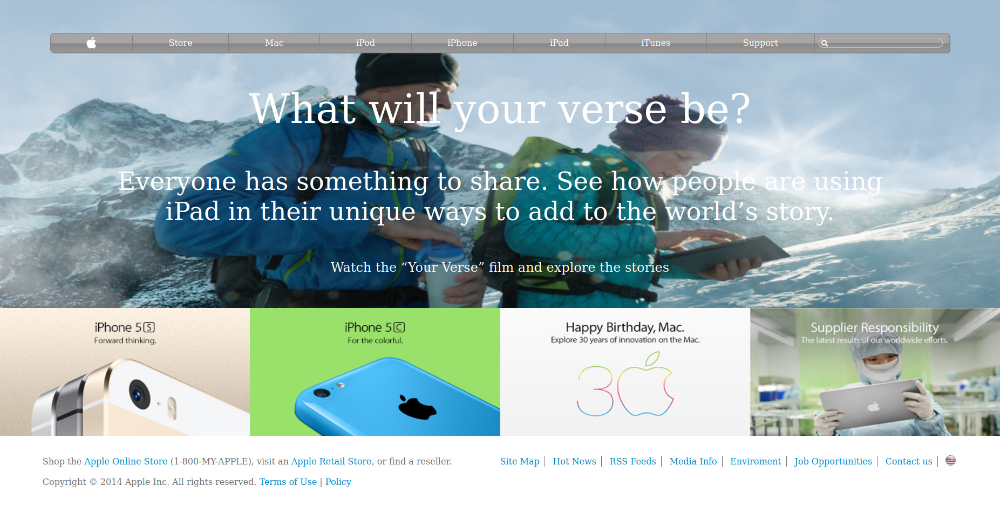

# Old Apple webpage clone

> Fourth project in the HTML/CSS module.

This is a microverse HTML/CSS project, I was required to exercise the use of linear-gradient colors to style an element.
I managed to create a clone of the old Apple webpage - Link to the original page is right here [Old apple webpage](http://archive.fo/UW4oR) satisfying all the requirements.

Find the live version of this project here [live version](https://raw.githack.com/tacodtripe/Old-Apple-Webpage/master/index.html)

## Built With

- HTML and CSS.

## Authors

👤 Raul Figueroa

- Github: [@tacodtipe](https://github.com/tacodtripe)
- Twitter: [@raul_figueroa17](https://twitter.com/raul_figueroa17)
- Linkedin: [linkedin](https://www.linkedin.com/in/luis-raul-figueroa-soto-63411118a/)

## 🤝 Contributing

Contributions, issues and feature requests are welcome!

Feel free to check the [issues page](issues/).

## Show your support

Give a ⭐️ if you like this project, enjoy!
